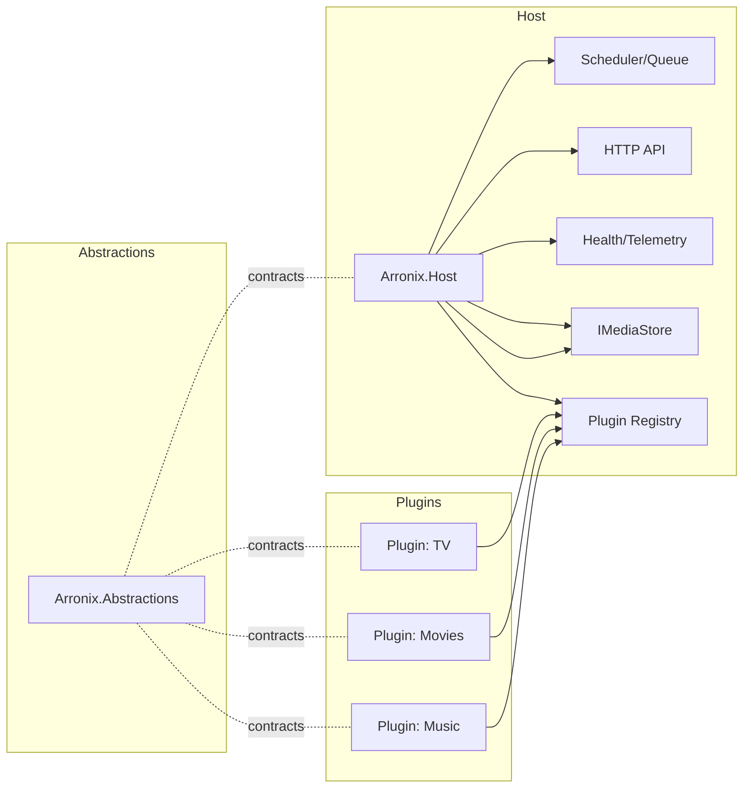

# Arronix Architecture

This document consolidates and expands the architectural content that was previously embedded in `README.md`. It explains the core platform design, layering, plugin model, contracts, policy pipelines, and forward evolution strategy.

## 1. Purpose & Scope

Arronix provides a **single host runtime** for multiple media domains (TV, movies, music, books, etc.) implemented as **independent plugins**. The goal is to replace the historical proliferation of separate *-arr* applications with a unified, extensible core while preserving reliability and user expectations.

Key outcomes:

- One scheduler, one queue, one API surface (progressively generalized).
- Media‑agnostic core orchestration; all media semantics live in plugins.
- Stable versioned contracts enabling externally developed plugins without forking.
- Policy-driven behavior (parsing, matching, quality, import, naming) declared via manifests.

## 2. High-Level Structure

```text
Core
 ├── Abstractions
 ├── Host Runtime
 ├── Plugin Loader
 └── Storage Layer
Plugins
 ├── TV
 ├── Movies
 ├── Music
 └── Books
```

Mermaid overview:



## 3. Core Components

| Component | Responsibility | Notes | Status |
|-----------|---------------|-------|--------|
| Abstractions (`Arronix.Abstractions`) | Versioned interfaces, DTOs, policy & job contracts | Semantic versioning with compatibility ranges in plugin manifests. | ✅ **Implemented** (v0.1.0) |
| Host Runtime (`Arronix.Host`) | DI composition root, plugin lifecycle, scheduling, job execution, API hosting, telemetry | Uses `AssemblyLoadContext` per plugin for isolation. | 🚧 **Planned** |
| Plugin Loader | Discovers `plugin.json`, loads assemblies, validates contract ranges, registers services | Enforces capability declarations & token exposure. | 🚧 **Planned** |
| Scheduler / Queue | Central orchestration of background jobs, indexer runs, parsing tasks, imports | Media‑agnostic; jobs supplied by plugins via contracts. | 🚧 **Planned** |
| Policy Engine | Executes declared policy chains for parsing, matching, quality, import, naming | Chains defined in manifest; host injects execution context. | 🚧 **Planned** |
| Storage Layer | Polymorphic persistence via `IMediaStore` and plugin‑owned schema fragments | Core stores cross‑media relations (e.g., history, downloads). | 🚧 **Planned** |
| HTTP API | Unified public interface; legacy compatibility layer + new media‑neutral endpoints | Gradual migration from Sonarr v5 shapes. | 🚧 **Planned** |
| Health & Telemetry | Status endpoints, metrics, structured events | Plugin participation via optional health contributors. | 🚧 **Planned** |

### 3.1 Arronix.Abstractions (Implemented)

**Version:** 0.1.0  
**Status:** ✅ Complete and stable

The abstractions layer provides the foundational contracts that enable media-agnostic plugin development. All public APIs in this layer are stable and follow semantic versioning guarantees.

**Key Components:**

- **Identity Types:**
  - `MediaKindId`: Unique identifier for media types (e.g., "tv", "movies")
  - `MediaItemId`: Internal identifier for specific media items
  - `ReleaseId`: Identifier for downloadable releases

- **Media Interfaces:**
  - `IMediaKind`: Defines identity and capabilities of a media type
  - `IMediaIdResolver`: Maps external IDs (TVDB, TMDB) to internal IDs

- **Parsing & Quality:**
  - `IReleaseParser`: Extracts structured data from release titles
  - `IQualityModel`: Evaluates quality and determines upgrades

- **Import & Naming:**
  - `IImportPipeline`: Validates and imports media files
  - `IRenamePolicy`: Generates file names from templates
  - `ILibraryLayout`: Defines folder structure

- **Providers:**
  - `IMetadataProvider`: External metadata sources
  - `IIndexerProvider`: Release indexers (trackers/Usenet)
  - `IDownloadClientAdapter`: Download client integration

- **Scheduling:**
  - `IScheduledJob`: Background task interface
  - `IBackgroundTaskRegistry`: Job registration and management

- **DTOs:**
  - `ReleaseCandidate`, `ParsedRelease`, `MatchDecision`, `ImportDecision`
  - `QualityTier`, `Language`, `CutoffPolicy`
  - `LibraryPathSpec`, `NamingToken`

- **Health & Errors:**
  - `HealthCheck`, `HealthStatus`, `HealthSeverity`
  - `CoreErrorCode` enumeration

**Documentation:**
- API Stability Policy: [`docs/contracts/stability.md`](../docs/contracts/stability.md)
- Contract tests: `src/Arronix.Abstractions.Tests/`

## 4. Plugin Model

Each plugin is a self-contained module providing:

- `plugin.json` manifest (identity, capability set, policy graphs, token declarations, contract version ranges).
- One or more assemblies implementing `IPluginModule` (composition entrypoint) and service registrations.
- Policy handlers, job providers, indexing + metadata providers, parsing logic, import/naming strategies.
- Plugin-specific storage migrations / schema definitions.

Isolation considerations:

- Separate `AssemblyLoadContext` enables unloading (future) and version side‑by‑side.
- Only explicitly exported services (defined by abstractions) are visible to Core.
- No direct cross-plugin calls; interaction flows through Core contracts / events.

### 4.1 Manifest Specification (v0)

```json
{
  "id": "tv",
  "name": "TV Shows",
  "version": "0.1.0",
  "contracts": { "arronix": ">=0.1 <1.0" },
  "identifiers": ["tvdb", "tmdb"],
  "capabilities": ["indexing", "metadata", "parsing", "renaming", "import"],
  "tokens": ["{SeriesTitle}", "{SeasonNumber}", "{EpisodeNumber}", "{EpisodeTitle}"],
  "policies": {
    "parsing": ["SceneNumbering", "MultiEpisode", "YearDisambiguation"],
    "matching": ["ExactSeriesMatch", "SeasonWindow", "AirdateGuard"],
    "quality": ["SourceTier", "Codec/BitDepth", "Cutoff"],
    "import": ["LibraryLayout", "Dup/UpgradeRules"]
  }
}
```

Validation steps during load:

1. Manifest JSON parsed & schema-validated.
2. Contract range compatibility check against host’s `Arronix.Abstractions` version.
3. Capabilities -> required interface implementations verified (e.g., declaring `indexing` must register an `IIndexerProvider`).
4. Policy chain ids cross-checked with provided handlers.
5. Token collisions resolved / rejected if ambiguous across plugins.

### 4.2 Policy Chains

Policies are ordered handlers forming a pipeline. Categories currently envisaged:

- Parsing (filename → semantic components)
- Matching (associate releases with canonical media entities)
- Quality (rank, tier, cutoff enforcement)
- Import (file placement, upgrades, duplicates)
- Naming (materialize tokens into final file/folder paths)

Execution contract (simplified):

- Input: context DTO + intermediate state.
- Each policy may augment annotations, raise warnings, short‑circuit, or emit structured failures.
- Output: enriched context or terminal result consumed by downstream subsystem (e.g., Importer).

## 5. Data & Storage Model

Principles:

- Core maintains cross‑media abstractions: library membership, download history, activity log, queue entries.
- Plugins define media‑specific entities (e.g., Series, Season, Track, Album) and persistence mappings.
- `IMediaStore` facade provides polymorphic CRUD + query surfaces returning discriminated records.
- Migration tooling (initial placeholder: `tools/migrate-v4-to-core`) converts legacy TV-focused schema into polymorphic baseline.

Future enhancements:

- Pluggable storage backends (initial default: relational DB).
- Schema version negotiation per plugin (enables independent evolution).

## 6. Scheduling & Background Work

The scheduler orchestrates units of work implementing `IJob` (name/identity + execute method + concurrency hints). Plugins register jobs at activation time. The host enforces:

- Global concurrency limits.
- Category or capability-scoped throttles (e.g., indexers).
- Back-off & retry semantics (exponential, jittered) with plugin-provided classification of failures.

Queue entries reference abstract media identifiers; plugin resolvers rehydrate domain models on execution.

## 7. API Strategy

Phased approach:

1. Compatibility Surface: Maintain core TV endpoints (for migration continuity).
2. Media-Agnostic Layer: Introduce generic endpoints (e.g., `/media/{kind}/items`, `/policies/{category}`).
3. Capability Endpoints: Dynamically enumerate plugin-declared capabilities & tokens.
4. Event / WebSocket Channel: Unified real-time feed with event types namespaced by plugin id.

Versioning handled semantically; breaking media-agnostic shape changes gated by accept headers or query opt-in (TBD).

## 8. Contracts & Versioning

- `Arronix.Abstractions` is semver; plugins declare acceptable range via `contracts.arronix` (npm/yarn style range semantics).
- Host rejects plugin load if no overlap.
- Policy handlers & DTOs evolve through additive changes; removals occur only at major boundary.
- Experimental interfaces may be explicitly marked (annotation) and blocked from external release ranges until stabilized.

## 9. Token System & Naming

Plugins declare tokens (`{SeriesTitle}`, `{EpisodeNumber}`, etc.). Core:

- Validates naming templates only use tokens from the target media kind + globally allowed tokens (timestamps, quality tags, etc.).
- Provides a formatting pipeline (token resolution, sanitization, collision handling, truncation rules).

Conflicting token names across plugins are namespaced or rejected (strategy under evaluation). Aim: stable meaning per token string within a media context.

## 10. Telemetry & Health

Health contributions:

- Plugin modules can register `IHealthContributor` returning structured status items (degraded, healthy, error) with remediation hints.
- Core aggregates & exposes `/health` endpoint plus machine-readable JSON.

Telemetry:

- Structured events (job start/finish, import decision, policy failure) with correlation ids.
- Extensible sinks (console, file, OTLP exporters) configured centrally; plugins raise events via abstractions (never directly to sink).

## 11. Security & Isolation (Initial Considerations)

- Plugin code executes in-process; early versions rely on trust + review.
- Future hardening: restricted permission descriptors (e.g., no network unless declares `indexing`), WASM or process isolation candidates.
- Manifest-specified capabilities shape accessible contracts (principle of least privilege via DI registration filtering).

## 12. Error Handling & Resilience

- Policy pipelines produce structured failures with user-facing messages and internal diagnostic codes.
- Scheduler retries transient failures (classification provided by job or exception mapping).
- Circuit breakers around external indexer / metadata providers (shared across plugins when using same remote).

## 13. Migration Path (Sonarr v4/v5 → Arronix)

Steps:

1. Extract TV logic into first plugin while preserving prior behavior through compatibility endpoint layer.
2. Introduce polymorphic media tables & re-map existing series/episode concepts.
3. Gradually replace hard-coded TV references in Core with abstraction invocations.
4. Enable additional media plugins (Movies, Music) once token & policy generalization complete.

## 14. Development & Testing Strategy

Testing layers:

- Contract Tests: Ensure host & plugin interface stability (run against abstractions).
- Policy Golden Tests: Deterministic parsing/renaming scenarios.
- Integration Tests: Scheduler + policy + storage round-trips.
- Migration Tests: Database transformation correctness.

Tooling goals:

- CLI helpers for manifest validation & plugin scaffold generation.
- Static analysis to detect forbidden direct plugin-to-plugin references.

## 15. Future Directions (Exploratory)

| Area | Potential Evolution |
|------|---------------------|
| Isolation | WASM or process per plugin; hot unload/reload. |
| Storage | Multi-backend adapters (Postgres, SQLite, cloud KV). |
| Policy Authoring | Declarative DSL for simple chains (YAML/JSON) compiled to runtime graph. |
| Eventing | Internal event bus enabling plugin-level reactive features. |
| UI Integration | Dynamic UI component registry keyed by plugin capability & token exposure. |
| Distribution | Signed plugin packages, remote registry discovery. |

## 16. Design Principles (Summary)

- Media-agnostic Core
- Stable, versioned contracts
- Config/manifest-first extensibility
- Single scheduler & queue
- Policy chains over hard-coded conditionals
- Explicit capability declaration
- Testability by design
