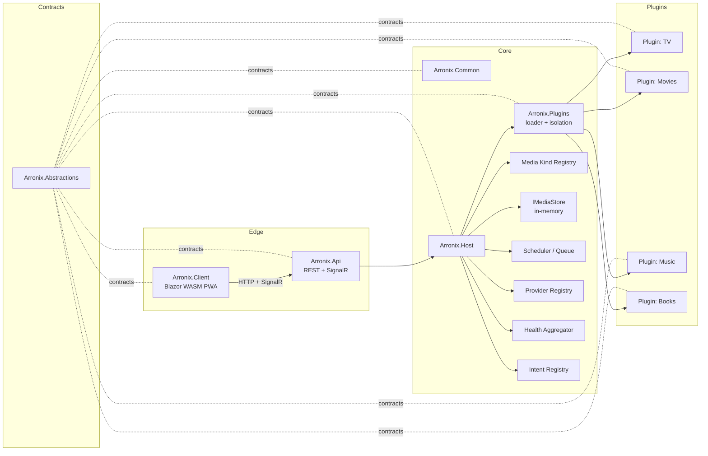

# Arronix Architecture

This document consolidates and expands the architectural content that was previously embedded in `README.md`. It explains the core platform design, layering, plugin model, contracts, policy pipelines, and forward evolution strategy.

> **Status of this document.** Section 3 records, per component, what is implemented, what is partial, and what is
> still planned, verified against the source tree rather than against intent. Where something does not work, this
> document says so and says what is missing. Design documents under `docs/design/` describe intended end states and
> are **not** evidence that a thing exists.

## 1. Purpose & Scope

Arronix provides a **single host runtime** for multiple media domains (TV, movies, music, books, etc.) implemented as **independent plugins**. The goal is to replace the historical proliferation of separate *-arr* applications with a unified, extensible core that meets the reliability and user expectations those applications set.

**Arronix is a clean-sheet rewrite, not a restructuring of an existing *-arr* codebase.** The *-arr* applications
are surveyed in depth throughout this document and under `docs/design/` — by file and line — as *evidence* for
what to build and what to avoid. Nothing is ported: no type, no schema, no wire shape, no API surface. There is no
backwards compatibility and no in-place upgrade path (§14, §14.1), and the codebase is en-US (§3.4).

Key outcomes:

- One scheduler, one queue, one API surface (progressively generalized).
- Media‑agnostic core orchestration; all media semantics live in plugins.
- Versioned contracts enabling externally developed plugins without forking — stable **from 1.0**, freely
  changeable below it (§9).
- Policy-driven behavior (parsing, matching, quality, import, naming) declared via manifests.

## 2. High-Level Structure

```text
Contracts
 └── Arronix.Abstractions          (0.3.0 — the only assembly a plugin or the client may reference)
Core
 ├── Arronix.Common                (0.1.0 — host-side shared implementation)
 ├── Arronix.Plugins               (0.1.0 — manifest, versioning, isolation, loading, capability gating)
 └── Arronix.Host                  (0.1.0 — media registry, storage, scheduler, providers, health, intent)
Edge
 ├── Arronix.Api                   (0.1.0 — ASP.NET Core REST + SignalR; NOT Blazor)
 └── Arronix.Client                (0.1.0 — Blazor WebAssembly PWA; references Abstractions only)
Plugins
 ├── Arronix.Plugin.Tv
 ├── Arronix.Plugin.Movies
 ├── Arronix.Plugin.Music
 └── Arronix.Plugin.Books
```

Mermaid overview:


```mermaid
flowchart LR
  subgraph Contracts
    A[Arronix.Abstractions]
  end

  subgraph Core
    Common[Arronix.Common]
    Loader[Arronix.Plugins<br/>loader + isolation]
    Host[Arronix.Host]
    Host --> Kinds[Media Kind Registry]
    Host --> Store[IMediaStore<br/>in-memory]
    Host --> Sched[Scheduler / Queue]
    Host --> Prov[Provider Registry]
    Host --> Health[Health Aggregator]
    Host --> Intent[Intent Registry]
  end

  subgraph Edge
    Api[Arronix.Api<br/>REST + SignalR]
    Client[Arronix.Client<br/>Blazor WASM PWA]
  end

  subgraph Plugins
    TV[Plugin: TV]
    MV[Plugin: Movies]
    MU[Plugin: Music]
    BK[Plugin: Books]
  end

  A -. contracts .- Host
  A -. contracts .- Common
  A -. contracts .- Loader
  A -. contracts .- Api
  A -. contracts .- Client
  A -. contracts .- TV
  A -. contracts .- MV
  A -. contracts .- MU
  A -. contracts .- BK

  Host --> Loader
  Loader --> TV
  Loader --> MV
  Loader --> MU
  Loader --> BK
  Api --> Host
  Client -- HTTP + SignalR --> Api
```

The one-way arrows matter. `Arronix.Client` and every `Arronix.Plugin.*` declare exactly one project reference —
`Arronix.Abstractions` — so neither the browser nor a plugin can reach a host-side implementation assembly. This is
mechanically checkable in the project files, not a convention.

## 3. Core Components

Legend: ✅ implemented · 🟡 partial (works, with a stated gap) · 🚧 planned (little or no code).

| Component | Responsibility | Status | What is actually true |
|-----------|---------------|--------|-----------------------|
| Abstractions (`Arronix.Abstractions`) | Versioned interfaces, DTOs, policy & job contracts | ✅ **Implemented** (0.3.0) | 157 source files, zero package references. Seven unmarked areas plus five published `[Experimental]` (§9.1). Unmarked is not a stability promise below 1.0. |
| Common (`Arronix.Common`) | Host-side shared implementation of the contract layer | ✅ **Implemented** (0.1.0) | Serialization, naming, hashing, archives, text, time, collections, XML, net. 420 tests. |
| Plugin Loader (`Arronix.Plugins`) | Discovers `plugin.json`, isolates and loads assemblies, validates contract ranges, gates capabilities | ✅ **Implemented** (0.1.0) | 16-step admission pipeline (§4.1). Per-plugin `AssemblyLoadContext`; reference graph checked from PE metadata *before* any type initializer runs; scoped file system, HTTP, cache, rate limiter and event publisher. 280 tests. |
| Host Runtime (`Arronix.Host`) | DI composition root, plugin lifecycle, media registry, storage, scheduling, providers, health, intent | 🟡 **Partial** (0.1.0) | Every subsystem below is built and tested (251 tests) and `AddArronixHost` composes them. **Gap:** the runtime registers no `ICacheProvider`, `ITelemetryEmitter`, `IEventPublisher`, `IHostRuntimeInfo` or `IOperatingSystemInfo`, and the loader treats all five as preconditions — so on a host composed only from this repository **no plugin reaches `Active`**. Plugins are exercised in tests, which supply doubles. |
| Media Shape Registry (`Arronix.Host.Media`) | Validates a declared media shape and publishes it | ✅ **Implemented** | Sixteen-rule `ValidatedShape` gate (§5.9), kind registry, host-derived affordances, completeness calculator. All four reference shapes pass. |
| Scheduler / Queue (`Arronix.Host.Scheduling`) | Central orchestration of background jobs | 🟡 **Partial** | Schedule grammar, queue, concurrency governor, jittered backoff ladder, failure classifier and correlation context are implemented and tested; the scheduler reads `TimeProvider` and exposes an explicit `TickAsync`. **Gaps:** queue state is in-memory and lost on restart; there is no cron grammar (§7); nothing yet drives a real acquisition, because no download client or import pipeline is registered. |
| Storage Layer (`IMediaStore`) | Library state, item↔file links, group membership | 🟡 **Partial** | The seam and its records exist, with uniqueness and span invariants enforced. **Gap:** the only implementation is in-memory. There is **no persistence and no EF Core anywhere in the platform assemblies** — nothing survives a restart. |
| Provider Subsystem (`Arronix.Host.Providers`) | Definitions, status and test for the five provider families (§3.3) | 🟡 **Partial** | Registry, definition store, status store, session store, test service, and the indexer and notification dispatchers. **Gap:** no concrete provider implementation ships; the four media plugins register reference indexers and catalogers only. |
| Health & Telemetry | Status aggregation, structured events | 🟡 **Partial** | `IHealthAggregator` with plugin, scheduler and provider contributors is implemented and tested, and the API exposes it. **Gap:** the telemetry *contracts* exist (`ITelemetryEmitter`, `ITelemetrySink`, `ITelemetryEnricher`, `ITelemetryEventFilter`) but **no emitter or sink is implemented** — there is no console, file or OTLP exporter. |
| HTTP API (`Arronix.Api`) | Media-neutral REST + SignalR surface | 🟡 **Partial — does not currently compile** | 24 files implementing the full §8 route table, event hub, secret redaction, client static-file hosting and a hand-rolled OpenAPI document. **It does not build:** six `CS0246` errors, because it binds to two host types that do not exist — `IProviderRegistry` (the host ships a concrete `ProviderRegistry`) and `IPluginStateRegistry` (the host exposes `PluginBootstrapper.States`). Until those two are reconciled the API cannot be run. |
| Web Client (`Arronix.Client`) | Installable Blazor WebAssembly PWA | ✅ **Implemented** (0.1.0) | 27 C# + 46 Razor files; builds and publishes clean to `browser-wasm`. References `Arronix.Abstractions` only. Renders any media kind from published descriptors; holds no compile-time knowledge of any media kind. |
| Media Plugins (Tv, Movies, Music, Books) | Reference implementations of the shape model | ✅ **Implemented** (0.1.0 each) | Each declares one project reference (Abstractions) and **zero** package references. Between them they exercise every optional construct in the shape model (§5.10). |
| Policy Engine | Executes declared policy chains | 🚧 **Planned** | Policy graphs are **declared and syntactically validated only** — categories are closed, identifiers must be non-blank and unique within a category. Nothing cross-checks an identifier against a handler, and **nothing executes them**. See §4.2. |
| Legacy compatibility API | Sonarr-shaped endpoints for migration continuity | 🚧 **Not built** | Deliberately deferred; see §8. |

### 3.1 Verification snapshot

```
dotnet build Arronix.sln  — 0 warnings, 0 errors (every project, Arronix.Api included)
dotnet test  Arronix.sln  — 1,313 passing, 0 failing, 1 skipped across seven test projects:
                            Common 420 · Plugins 280 · Host 244 · Architecture 143 (+1 skipped)
                            Abstractions 80 · Plugin.Tv 80 · Plugin.Music 66
```

Warnings are errors platform-wide (`TreatWarningsAsErrors`, `AnalysisLevel=6.0-all`, `EnforceCodeStyleInBuild`), so
"0 warnings" is a build gate rather than a courtesy.

The cross-cutting governance suite now exists as its own project, `Arronix.Architecture.Tests`, rather than under
`Arronix.Abstractions.Tests/Governance/` as originally planned. It covers contract areas and the experimental
surface, capability gating, naming and intent vocabulary, repository-wide invariants (including the en-US rule of
§3.4) and project topology.

Test projects that the plan calls for but which **do not exist**: `Arronix.Api.Tests`,
`Arronix.Plugin.Movies.Tests` and `Arronix.Plugin.Books.Tests`.

### 3.2 Arronix.Abstractions (0.3.0)

The abstractions layer provides the foundational contracts that enable media-agnostic plugin development. It takes
**zero package references**, which is what lets both a plugin and a WebAssembly client reference it and nothing else.

Areas carried forward from 0.1.0 and 0.2.0 without an `[Experimental]` marker. "Not experimental" is not a promise
that they are settled — below 1.0 any of them may still be changed, renamed or deleted (§9):

- **Identity:** `MediaKindId`, `MediaItemId`, `ReleaseId`
- **Media:** `IMediaKind`, `IMediaIdResolver`
- **Parsing & quality:** `IReleaseParser`, `IQualityModel`
- **Import & naming:** `IImportPipeline`, `IRenamePolicy`, `ILibraryLayout`
- **Scheduling:** `IScheduledJob`, `IBackgroundTaskRegistry`
- **DTOs:** `ReleaseCandidate`, `ParsedRelease`, `MatchDecision`, `ImportDecision`, `QualityTier`, `Language`, `CutoffPolicy`, `LibraryPathSpec`, `NamingToken`
- **Health & errors:** `HealthCheck`, `HealthStatus`, `HealthSeverity`, `CoreErrorCode`

(`IHealthContributor` carries `ARX0006` and the whole `Telemetry` namespace carries `ARX0011`, so neither belongs
on this list — see the 0.2.0 infrastructure areas in
[`src/Arronix.Abstractions/README.md`](src/Arronix.Abstractions/README.md).)

Areas added in 0.3.0. All are published `[Experimental]` under their own diagnostic id, so consuming them is a
deliberate, greppable, file-scoped opt-in:

| Area | Diagnostic id | Contains |
|------|---------------|----------|
| `Arronix.Abstractions.Shape` | `ARX0013` | The media shape model and its four behavior seams — §5. |
| `Arronix.Abstractions.Plugins` | `ARX0014` | `IPluginModule`, `IPluginContext`, `IPluginRegistry`, `PluginId`, `Capability`, `CapabilitySet`. |
| `Arronix.Abstractions.Providers` | `ARX0015` | Stateless provider contracts — the five families of §3.3 (`IIndexer`, `IDownloader`, `INotifier`, `ICataloger`, `ICurator`) plus declarative settings. |
| `Arronix.Abstractions.Intent` | `ARX0016` | What a plugin says a user can *do* — browse axes, sorts, filters, actions, states, external surfaces, workbenches. |
| `Arronix.Abstractions.Wire` | `ARX0017` | The DTOs that cross the HTTP boundary, including host-derived `Affordance`. |

`Arronix.Abstractions.Providers` contains **no stable types at all**. It once shared its namespace with a trio of
stable legacy provider contracts; as of 0.4.0 those are deleted (§3.3), so every type in the namespace now requires
an `ARX0015` opt-in.

**Documentation:** API stability policy — [`docs/contracts/stability.md`](docs/contracts/stability.md).
Contract tests — `src/Arronix.Abstractions.Tests/`.

### 3.3 Provider families (0.4.0)

A **provider** is a stateless adapter to an external service. `ProviderFamily` is a closed, five-member enum,
because the host dispatches on it: each family has its own registration method on `IPluginRegistry`, its own status
policy and its own configuration surface.

| Family | Contract | Registration | Answers |
|--------|----------|--------------|---------|
| `Indexer` | `IIndexer` | `AddIndexer(IndexerRegistration)` | Where can this release be obtained? |
| `Downloader` | `IDownloader` | `AddDownloader(DownloaderRegistration)` | Transfer it, and report on the transfer. |
| `Notifier` | `INotifier` | `AddNotifier(NotifierRegistration)` | Tell someone outside that something happened. |
| `Cataloger` | `ICataloger` | `AddCataloger(CatalogerRegistration)` | **What a thing *is*** — canonical facts that populate the catalog record. |
| `Curator` | `ICurator` | `AddCurator(CuratorRegistration)` | **Which things you *want*** — what belongs in the library at all. |

The last two are the pair most easily confused, and the split is deliberate. A **Cataloger** is an external
*authority*: it resolves identity and supplies facts about a thing that exists in the world, feeding
`LevelIdentity.HasCatalogRecord`. A **Curator** is an external *opinion*: it supplies a list of things the user
wants acquired, and says nothing about what any of them are. TheMovieDB is a Cataloger; a Trakt watchlist is a
Curator. A plugin routinely needs both, and neither can be derived from the other.

Curation is gated by `Capability.Curation` (wire name `curation`).

**The legacy provider trio is deleted, with no back-compatibility.** `IIndexerProvider`, `IMetadataProvider` and
`IDownloadClientAdapter` — together with their DTOs (`IndexerCapabilities`, `MetadataSearchResult`, `MetadataItem`,
`DownloadStatus`) and the `StableProviderBridge` that existed only to project between the two vocabularies — were
removed outright in 0.4.0. There is no `[Obsolete]` period, no shim and no dual contract. See §14 for why, and
[`docs/contracts/stability.md`](docs/contracts/stability.md) for the full rename table.

### 3.4 Language: the codebase is en-US

Every identifier, XML doc comment, inline comment, string literal and Markdown file in `Arronix.*` and `docs/` is
**American English**. This is not a style preference: the .NET BCL is en-US (`Initialize`, `Normalize`, `Serialize`,
`Color`, `CodeAnalysis`), so en-US spelling aligns Arronix identifiers *with* the members they sit beside rather
than against them. `Catalog` not `Catalogue`, `Normalize` not `Normalise`, `Behavior` not `Behaviour`, `Canceled`
not `Cancelled`, `Labeled` not `Labelled`.

Legitimate exceptions are names Arronix does not own: BCL and SDK members, third-party and proper nouns (`Calibre`),
GitHub Actions builtins (`cancelled()`), quoted external text, and the historical left-hand column of a rename
table. The legacy trees (`src/NzbDrone.*`, `src/Sonarr.*`, `frontend/`) are out of scope and unchanged — they are
already effectively en-US in any case.

## 4. Plugin Model

Each plugin is a self-contained module providing:

- `plugin.json` manifest (identity, capability set, media kinds, policy graphs, token declarations, contract version ranges).
- Exactly one assembly implementing exactly one `IPluginModule` (composition entrypoint).
- A media shape (§5), an intent surface, and the behavior seams it chooses to implement.
- Providers from any of the five families (§3.3): indexers, downloaders, notifiers, catalogers, curators.

Isolation, as implemented:

- A dedicated `AssemblyLoadContext` per plugin. `Arronix.Abstractions` resolves to the **host's** instance so that
  casts across the boundary succeed; a deny-list of host implementation assemblies **throws** rather than returning
  `null`, because returning `null` would fall back to the default context and silently succeed.
- The plugin's reference graph is inspected from PE metadata **before** a load context is created, so an illegal
  reference is refused before a single type initializer runs.
- Plugins receive only scoped platform services: a file system rooted at granted paths, an HTTP gateway with host
  allow/deny lists, a partitioned cache, a partitioned rate limiter, and an event publisher filtered to what the
  plugin may see.
- No direct cross-plugin calls; interaction flows through host contracts and events.
- **Unloading is not implemented.** Contexts are collectible in principle but nothing unloads a plugin at runtime.

### 4.1 Manifest Specification (schemaVersion 0)

The runtime gate is `Arronix.Plugins.Manifest.PluginManifestReader` plus `PluginManifestValidator`, which read into
required members with unmapped members disallowed. `src/Arronix.Plugins/Manifest/plugin.schema.json` exists as an
**editor aid only** and is never consulted at load time.

Required: `schemaVersion`, `id`, `name`, `version`, `contracts`, `entryAssembly`, `capabilities`.
Optional: `description`, `mediaKinds`, `identifiers`, `tokens`, `policies`. Any other key is a load failure.

```json
{
  "schemaVersion": 0,
  "id": "tv",
  "name": "Television",
  "version": "0.1.0",
  "contracts": { "arronix": ">=0.3 <0.4" },
  "entryAssembly": "Arronix.Plugin.Tv.dll",
  "mediaKinds": ["tv"],
  "identifiers": ["tvdb", "tmdb", "imdb"],
  "capabilities": ["media-kind", "parsing", "matching", "indexing", "quality", "renaming", "metadata"],
  "tokens": [
    { "name": "{Series Title}", "description": "The library entry's title", "exampleValue": "The Expanse", "isRequired": true },
    { "name": "{season:00}", "description": "The outer ordinal, zero-padded to two digits", "exampleValue": "01" }
  ],
  "policies": {
    "parsing":  ["OrdinalPair", "CalendarDate", "FlatOrdinal", "MultiUnit", "WholeRun", "YearDisambiguation"],
    "matching": ["ExternalIdentifier", "ExactTitleMatch", "CoordinateResolution", "AliasOverlay", "SpanConstraint"],
    "quality":  ["SourceTier", "ResolutionTier", "RemuxTier", "Cutoff"],
    "naming":   ["OrdinalPattern", "CalendarPattern", "FlatPattern", "MultiUnitStyle", "SequenceFolder"]
  }
}
```

Field rules as enforced:

- **`schemaVersion`** — integer, currently only `0`.
- **`id`** — lower-case alphanumeric segments separated by dots, starting with a letter.
- **`version`** — Semantic Versioning 2.0.0, with full prerelease precedence.
- **`contracts.arronix`** — a **documented subset** of npm/yarn range syntax: comparison operators, whitespace
  conjunction, `||` alternation, and partial versions. **Caret, tilde, wildcards and hyphen ranges are rejected**
  — four spellings of "the 0.3 line" is three too many.
- **`entryAssembly`** — a bare `*.dll` file name resolved inside the plugin's own folder. Path separators (both
  kinds, on every platform) and parent-directory segments are rejected.
- **`capabilities`** — at least one, from a closed vocabulary of fourteen: `indexing`, `metadata`, `parsing`,
  `matching`, `quality`, `renaming`, `import`, `download`, `notification`, `media-kind`, `import-list`, `network`,
  `storage`, `telemetry-sink`. `network` is *implied* by `indexing`, `metadata`, `download` or `notification` and
  should not be declared explicitly — declaring it without a matching registration fails the forward check.
- **`mediaKinds`** — requires the `media-kind` capability, and that capability requires at least one entry here.
- **`tokens`** — either a brace-delimited string, or an object with `name` plus optional `description`,
  `exampleValue` and `isRequired`. A bare string is widened to a descriptor with an empty description.
- **`policies`** — five closed categories: `parsing`, `matching`, `quality`, `import`, `naming`. A sixth key is a
  load failure. Identifiers must be non-blank and unique within their category.

**Load pipeline (16 steps).** A failure at any step **quarantines that plugin only**; the host and every other
plugin continue. Every failure carries a `CoreErrorCode` and the specific defects.

| # | Step |
|---|------|
| 1 | Discover `plugin.json` under the configured extension folder. |
| 2–3 | Parse and validate the declaration into required members; unmapped keys are rejected. |
| 4 | Cross-installation identity: duplicate plugin ids, and the operator's disabled list. |
| — | *Host precondition* — refuse before loading anything if the host has registered no `ICacheProvider`, `ITelemetryEmitter`, `IEventPublisher`, `IHostRuntimeInfo` or `IOperatingSystemInfo`. **This is the check that currently fails for every plugin** (§3). |
| 5 | Contract range against the host's contract version, then the experimental gate: a plugin using experimental contracts must bound its range at or below the host's next minor. |
| 6 | Reference-graph inspection from PE metadata — the plugin must reference `Arronix.Abstractions` and no other Arronix assembly. |
| 7–8 | Create the isolated load context; locate the single `IPluginModule`, whose id must equal the manifest id. |
| 9 | Run `Configure`. Every registration is admitted or refused **as it is made** — the reverse half of the bidirectional capability check. A throwing plugin quarantines itself and never the host. |
| 10 | Forward half: every declared capability must have a matching registration. |
| 11–12 | The host's own admission check over what was registered — shape validation (§5.9) and intent-surface validation. |
| 13 | The manifest's declared tokens and the registered media shape's tokens must match **symmetrically**. |
| 14 | Token ownership across the whole installation. |
| 15 | Identifier conflicts, within the plugin and across the installation (including media-kind collisions). |
| 16 | Activate, and record the result in the runtime registry. |

Capability enforcement is **bidirectional** (steps 9 and 10): declaring a capability requires the matching
registration, *and* registering a gated contract requires the matching capability. Without the second direction a
plugin could register a gated implementation it never declared.

Not implemented from the earlier draft of this section: *"Policy chain ids cross-checked with provided handlers."*
There are no handlers to cross-check against (§4.2).

### 4.2 Policy Chains — declared, not executed

Policies are ordered handler identifiers grouped into five categories: parsing, matching, quality, import, naming.
The manifest declares them, the validator checks that the categories are known and the identifiers are non-blank and
unique, and the loader records them.

**Nothing executes a policy chain, and no execution contract exists.** There is no policy engine, no context DTO, no
short-circuit protocol. Behavior that this section previously described as a pipeline is, in the implemented
platform, either ordinary code inside a plugin or one of the four declarative seams in §5.8. This section is
retained because the manifest field is real; the runtime behind it is planned work.

## 5. The Media Shape Model

This is the central concept added in 0.3.0 and the thing that makes a media-agnostic host possible. Previous
sections of this document assumed the host would learn about a media kind through code. It does not. **A media kind
is a value.**

`MediaShape` is pure data — no delegates, no types, no interfaces. That is what lets one shape serve three
consumers at once: it is what the host validates and publishes, what every engine reads, and what a front end
renders from. Nothing is duplicated between them, so nothing can disagree.

**A shape is derived, not written (0.6.0).** A media kind is authored as typed C# — an entity whose properties
and attributes are the schema, plus a fluent configuration — and the host derives the `MediaShape`, the intent
surface and the naming tokens from it. The descriptors above are unchanged and are still the only thing
downstream sees; what changed is that they have one source of truth and it is the entity. A plugin registers a
kind by naming two types (`AddMediaType<TItem, TType>()`) and hands over no shape at all. See
`docs/design/typed-media-model.md`.

**Two promises this retracts, stated plainly rather than left standing.** While a media kind was pure data, a
kind's assembly was eligible for **unload** once its declaration was captured, and network privilege was
*structurally* ungrantable because there was no code in the plugin that could hold it. A typed kind ships code —
a title rewrite, recomputations, a template rule — so **neither holds any more**. Capability enforcement for a
media kind now rests on the manifest and the loader, exactly as it does for every other extension that ships
code. The threat model's T-01 reasoned partly from the stronger premise and should be re-read against this one.

### 5.1 Levels and roles

A shape declares a containment hierarchy of `MediaLevel`s: exactly one root, each level naming its parent, acyclic,
and at most one child per level. Every level declares `MediaLevelRoles`, a **flag set** rather than a position enum,
because roles are not mutually exclusive:

| Role | Meaning |
|------|---------|
| `LibraryEntry` | What a user adds. Owns the path, profiles, tags and root folder. Exactly one per shape. |
| `AcquisitionUnit` | What a search or a grab targets. |
| `VariantAxis` | Competing manifestations of the parent, with at-most-one-selected semantics. |
| `CompletenessUnit` | What "have" and "missing" are counted in. |
| `FileBearing` | Participates in the item-to-file join. |

Flags are necessary, not stylistic: the simplest reference kind (movies) carries four roles on a single level, and
the richest (music) spreads five roles over four levels. A closed position enum can express neither.

`LevelIdentity` separates the catalog record from the library record and declares which external identifier
schemes a level admits. This split is part of the shape, not a storage normalization.

### 5.2 Coordinates — addressing is not a property of a level

A level *admits* a set of `CoordinateSpace`s, and an item carries a `CoordinateSet` of readings, zero or more
populated. A space declares its `CoordinateKind` (`Ordinal`, `Date`, `Label` or `Singleton`), its ordered components
when ordinal, and four flags:

- `IsCanonical` — the space identity and completeness are measured in. Exactly one per level that declares any.
- `IsProvenanceSensitive` — a reading is only meaningful when its source text came from a release name rather than
  from a catalog or a file.
- `MayBeUnverified` — values may be extrapolated rather than mapped, and so may carry
  `CoordinateConfidence.Unverified`.
- `IsDense` — the sequence has no intentional holes, so a gap means something is *missing* rather than something
  never existed.

`Coordinate` is a **tagged struct** with one payload slot populated — not a string (which loses ordering) and not a
polymorphic record union (which would need `[JsonPolymorphic]` across two independently versioned assembly
boundaries). There is **no `[JsonPolymorphic]` anywhere in Abstractions**, deliberately.

An alternative numbering scheme taken from release names is not a new kind of addressing; it is a non-canonical,
provenance-sensitive, possibly-unverified space over the same ordinal shape. The three flags say exactly that.

### 5.3 Sequence axes

A `SequenceAxis` is a named run over one component of an ordinal space — not a level. It may carry a policy record
(a stored entity for the run) and `SequenceException`s: reserved values outside the dense run, optionally excluded
from completeness.

### 5.4 File binding

`FileBinding` is the item↔file join. The storage representation is always the triple `(item, file, ordinal?)`; the
declared booleans are uniqueness constraints the host enforces over that join, never a switch between schemas.

- `AnchorLevelId` — the level the file record hangs from.
- `UnitLevelId` — the level whose items the file satisfies; a descendant of, or the same as, the anchor.
- `AtMostOneFilePerUnit`, `AtMostOneUnitPerFile` — the two uniqueness constraints.
- `OrdinalIsMeaningful` — whether the files satisfying one item are an ordered sequence rather than a set.
- `SpanConstraints` — whether one file may straddle two values of a named coordinate component.

Anchor and unit differ in exactly one reference kind, and not by accident: in music the file row hangs at the
acquisition level while the items it satisfies sit two levels below, so **file ownership survives a change of
selected variant**. A single file-bearing level cannot express that.

### 5.5 Variants, groupings, facets and monitoring

- `VariantSelection` declares at-most-one-selected semantics: whether the host may auto-switch, on which triggers
  (`Manual`, `OnImport`, `OnRefresh`), and whether completeness is counted against the selected variant or the union
  of all of them. `OnImport` is worth reading twice: where it is allowed, importing silently redefines which
  manifestation the library treats as canonical — surprising when it emerges from an implementation, unsurprising
  when a kind declares it.
- `GroupingAxis` is a collection that cuts *across* the hierarchy: arity (many-to-many or many-to-one), member
  position (`None`, `Ordinal`, `Labeled`), an optional designated primary member, lifetime (`RefCounted` with an
  orphan sweep, or `Independent`), and whether the group is monitorable, a discovery source, and has its own
  metadata path.
- `SelectionFacet` is the third profile axis, after "how good must a file be" and "which releases are preferred": it
  answers "which sub-items should exist at all". Three kinds — `Enumerated`, `Threshold`, `Flag` — because an
  enumeration alone cannot express "at least this many pages". `FacetApplication` distinguishes `Materialization`
  (the item is never created) from `Visibility` (the item exists but is hidden), which is the declared answer to the
  destructive-refresh surprise.
- `MonitorDimension` declares orthogonal axes of "does the user want this", as a toggle or an enumeration.
- `FormatFamily` gives each format family its own extension set, its own quality ladder and its own unknown tier —
  which is how one media kind carries two incomparable quality ladders (books: written and spoken) without the
  nonsense of ranking an audiobook against an EPUB.

### 5.6 Acquisition and search

`AcquisitionScope` declares how broad a grab is: `Single`, `SequenceSpan(axis)`, or `Ancestor(level)`. One planner
over three scopes replaces the reference applications' proliferation of per-shape fetch overloads.

Indexer eligibility is **pure set intersection** over a closed nine-member `SearchTerm` vocabulary — `FreeText`,
`WorkTitle`, `Creator`, `Issuer`, `Genre`, `Year`, `ExternalIdentifier`, `Ordinal`, `Date` — plus open `CategoryId`
values. A kind declares its required and optional terms and its categories; an indexer declares what it supports.
No media noun and no indexer-protocol search-mode string ever enters a shape.

### 5.7 Fields and values

`FieldDescriptor` declares a field's identity, value kind, semantics (a flag set including `Title`, `Sortable`,
`Groupable`, `Progress`), prominence (`Primary`, `Secondary`, `Detail`, `Diagnostic` — an *importance rank*, not a
layout) and choices. `FieldValue` is a tagged record over a closed twenty-member `FieldValueKind`.

Prominence is deliberately not a layout instruction. A shape says how important a field is; a front end decides
what that looks like.

### 5.8 The four behavior seams

Everything else in the model is declarative. Exactly four things a plugin must *do*:

| Seam | Responsibility |
|------|----------------|
| `IMediaShapeProvider` | Supply the shape. |
| `IReleaseMatcher` | Resolve release text to items, with provenance, coordinates and confidence. |
| `IReleaseQueryPlanner` | Turn an acquisition request into ordered query tiers; the first tier with any result wins. |
| `IMediaItemSource` | Project the plugin's own catalog, and propose/commit for working surfaces. |

`IMediaItemSource` closes the largest hole in the earlier design: with no persistence and no metadata pipeline, a
descriptor-driven UI could otherwise only render empty lists. The plugin projects its catalog; the host stores
only library state and merges the two.

Coordinate *ordering* is not a seam — it falls out of typed coordinates. Completeness is not a seam — it is
host-computable from `FileBinding`, `VariantSelection` and `SequenceException`.

### 5.9 Validation — parse, don't validate

`Arronix.Host.Media.ValidatedShape` applies **sixteen rules** to a declared shape at load time (pipeline step 11).
After that gate no host lookup can fail, so the rest of the host is written without defensive checks. The rules
cover: exactly one root; acyclicity; at most one child per level; exactly one `LibraryEntry`; variant-level parent
must be an acquisition unit; the unit level must be a descendant-or-self of the anchor; the ordinal flag requires
non-unique files per unit; exactly one canonical space per level that declares any; sequence axes and span
constraints must resolve to real ordinal components; format-family extension sets must be disjoint and ladder ranks
distinct; field ids unique per level with exactly one `Title`; and search kinds must resolve their target levels,
axes and ancestors.

Rules produce a `ShapeDefect` list, not an exception — every fault in one build.

Affordances (`Monitorable`, `Searchable`, `Refreshable`, `Renamable`, `Removable`, `Browsable`, `Selectable`,
`Taggable`, `Relocatable`, `Downloadable`) are **derived by the host** from the validated shape, never declared. A
declaration that can be derived is a declaration that can disagree.

### 5.10 The four reference shapes

They exist to prove the model is not fitted to one media kind. Between them they exercise every optional construct:

| Kind | Levels and roles | What it proves |
|------|------------------|----------------|
| **Movies** | 1: `movie` = `LibraryEntry \| AcquisitionUnit \| CompletenessUnit \| FileBearing` | Four roles fused on a single level — the case a closed position enum cannot express. (No `VariantAxis`: a film has no competing manifestations to select between.) A `Singleton` canonical space; both uniqueness booleans true; a `ManyToOne`, `Independent`, monitorable collection grouping with its own metadata — the one thing containment cannot express. |
| **TV** | 2: `series` = `LibraryEntry` → `episode` = `AcquisitionUnit \| CompletenessUnit \| FileBearing` | **A season is a sequence axis, not a level** — which is the point. Five coordinate spaces on one level (canonical dense ordinal, flat ordinal, date, and two provenance-sensitive may-be-unverified alias spaces); a sequence axis with a policy record and an excluded-from-completeness exception; `MustNotSpan` on the outer component and `MaySpan` on the inner; **1 file : N units**; `Single`, `SequenceSpan` and `Ancestor` scopes. |
| **Music** | 4: `artist` = `LibraryEntry` → `album` = `AcquisitionUnit \| FileBearing` → `release` = `VariantAxis` → `track` = `CompletenessUnit \| FileBearing` | **`AnchorLevelId` (album) ≠ `UnitLevelId` (track)**, with the variant axis sitting *between* them — so file ownership survives a variant switch. Variant selection with an `OnImport` trigger and variant-relative completeness; a sequence axis *without* a policy record. |
| **Books** | 3: `author` = `LibraryEntry` → `book` = `AcquisitionUnit` → `edition` = `VariantAxis \| CompletenessUnit \| FileBearing` | The mirror image of music: the same three roles that music spreads over three levels are fused onto one. **Two `FormatFamily` ladders** (written and spoken) with disjoint extension sets and two unknown tiers; `Threshold` and `Flag` selection facets across both `Materialization` and `Visibility`; a many-to-many grouping with `Labeled` positions, a primary member and ref-counted lifetime; one unit spanning many files with a **meaningful ordinal**. |

All four pass the sixteen-rule gate and are admitted by the registry — independent evidence that the rules describe
the real problem rather than the fixtures.

## 6. Data & Storage Model

Principles:

- Core maintains cross‑media abstractions: library membership, item↔file links, group membership, file records.
- Plugins own their catalog and project it through `IMediaItemSource`; the host does not store catalog data.
- `IMediaStore` is the facade. It enforces the `FileBinding` uniqueness booleans and span constraints as
  invariants rather than leaving them to callers.

**Current reality:** the only implementation is `InMemoryMediaStore`. **There is no persistence, no database, no
EF Core and no migration tooling anywhere in the platform assemblies.** Everything is lost on restart. This was a
deliberate scope decision for this milestone — the seam was designed first so that a backing store can be added
without reshaping the callers — but nothing about the platform is durable today.

Two consequences worth stating plainly:

- Span-constraint enforcement in the store reaches back through `IMediaItemSource` for coordinates, because the
  store holds none. A `MustNotSpan` rule therefore cannot be enforced for a unit the plugin's projection does not
  return.
- Queue and scheduler state are in-memory for the same reason (§7).

Planned: a durable backend, schema version negotiation per plugin, and pluggable storage backends. None of it
exists. See [`docs/design/storage-layer.md`](docs/design/storage-layer.md) for the intended design.

## 7. Scheduling & Background Work

Implemented. Plugins register jobs against the stable `IBackgroundTaskRegistry`/`IScheduledJob` contracts at
activation. The host enforces:

- **Schedule grammar:** `manual`, `startup`, `every <duration>`, `daily HH:mm`. **No cron.** No typed schedule
  contract was promoted either — the stable `RegisterJob(job, string)` already fixes the shape, and a four-form
  grammar does not need a contract to carry it.
- **Concurrency:** a governor with global and per-category limits. Acquisition is **non-blocking** — ready entries
  are walked rather than taken from the head, so a saturated throttle never head-of-line-blocks unrelated work.
- **Backoff:** an exponential, jittered ladder. The jitter source is injectable, so the exact rung of a given
  attempt is assertable in a test.
- **Failure classification** and **correlation ids** ride the stable `ResultData`/`Parameters` bags under published
  constants (`WellKnownJobParameters`, `WellKnownJobResults`) rather than through a newly promoted enum. This is
  recorded as a deliberate wart: promoting a four-value enum against zero implementers is exactly what the
  three-tier promotion rule exists to prevent.

Everything time-dependent reads `TimeProvider`, and `TickAsync` is public so a test drives the same code path the
deployment runs.

**Gaps:** queue entries do not survive a restart (§6), and no job yet performs a real acquisition, because no
download client or import pipeline implementation exists.

## 8. API Strategy — settled

The client/server split is decided and built. Two projects, one boundary.

**`Arronix.Api` — plain ASP.NET Core, not Blazor.** `Microsoft.NET.Sdk.Web`, **zero package references**, and
**zero `.razor` files**. It exposes:

- `GET /api` — a version index.
- `/api/v1/...` — the media-neutral surface: kinds and their descriptors; items by level, by id, and their children;
  actions; grouping axes; workbench proposal / options / commit; provider catalog and definitions with test and
  option lookup; plugins; jobs and job triggers; queue; health.
- `GET /health` at the application root, reachable independently of the SPA fallback.
- `/hub/events` — a SignalR hub carrying a single closed `EventKind` envelope, with per-media-kind subscription
  groups and a system group joined on connect.
- Static hosting for a configured client root, with PWA-correct cache headers (immutable `_framework/*`, no-store
  service worker and boot manifest, `application/wasm`, SPA fallback that never swallows `/api/`, `/hub/` or
  `/health`).

The API does **not** reference `Arronix.Client`; it serves a configured directory. That keeps the client
independently hostable and makes "the API is not Blazor" a testable property rather than a claim.

**Deviations to record honestly:**

- **The API does not currently compile** — see §3. Six `CS0246` errors against two host types that do not exist.
- **OpenAPI is hand-rolled.** No OpenAPI *serving* package is registered in `Directory.Packages.props`, and this
  project takes zero packages, so the document is generated at request time from the endpoint data source and typed
  result metadata. It has no security schemes, examples or polymorphism. If a generator package is ever registered,
  the two files under `OpenApi/` should be deleted.
- **The legacy compatibility surface was not built.** The phased plan this section previously described — maintain
  Sonarr-shaped TV endpoints, then layer a media-agnostic surface over them — is **dropped**. There is no legacy
  phase. The unified platform shares no database with Sonarr and offers no in-place upgrade path, so a compatibility
  shim would have been a shim over nothing. Migration is import-based, not schema-based.

**`Arronix.Client` — a separate Blazor WebAssembly PWA.** It references `Arronix.Abstractions` and nothing else —
the same discipline a plugin is held to, for the same reason: no host-side implementation assembly can ever be
shipped to a browser. It talks to the API over HTTP and SignalR.

The client renders **from descriptors, never from plugin-supplied component code**. A plugin cannot name, ship or
inject a component; it declares intent, and one file in the client (`Rendering/IntentResolver.cs`) maps intent to
components. Five closed-enum lookup tables make up the entire coupling, and each is a `switch` **without a discard
arm**, so adding a member to any intent vocabulary is a compile error until every table answers for it. That is
what makes "nothing in the client knows a media kind at compile time" checkable rather than merely asserted — a
fifth media kind requires zero client changes.

Where a declarative vocabulary genuinely cannot express a workflow — manual import of N files onto M units, being
the daily example — the escape hatch is `WorkbenchDescriptor`: a declared row/column editable grid over a
plugin-supplied proposal, driven by one generic client component. The escape hatch lets a plugin *point at* a
generic surface; it never lets a plugin *inject* markup.

Known limits, stated as limits: bespoke per-kind visualizations are not possible; cross-kind composite views are
host-composed only; and there is no rich text anywhere, because that is the first XSS surface.

## 9. Contracts & Versioning

- `Arronix.Abstractions` is semver; plugins declare an acceptable range via `contracts.arronix`.
- The host rejects a plugin load if there is no overlap.
- **Below 1.0 the contracts are unstable, and deliberately so.** This is SemVer 2.0.0 §4 applied literally: any
  contract may be changed, renamed or deleted in a MINOR release, and a contract with no implementer outside this
  repository is deleted outright rather than deprecated. There is no `[Obsolete]` period and no shim — see §14.1.
  "It is stable, so this needs a major version" has no referent here, because there is no consumer for whom the
  correction would be breaking, and 1.0 is the *next* major, so waiting for one means freezing whatever happened
  to be written first.
- **From 1.0**, contracts evolve additively and removals occur only at a major boundary. That is the right policy
  for a contract library with external consumers; it is the wrong one for a library with none, and applying it
  early is what produced the deletions recorded in [`docs/contracts/stability.md`](docs/contracts/stability.md).

### 9.1 Experimental contracts

New contract areas ship marked `[Experimental]` with a per-area diagnostic id (§3.2). Two rules follow, both
enforced:

1. Consuming an experimental area requires a **file-scoped** `#pragma warning disable ARXnnnn` with a reason. No
   project-wide `NoWarn` for an `ARXnnnn` exists anywhere in the platform.
2. A plugin whose declared contract range reaches past the host's **next minor** is refused at load (pipeline step
   5), because experimental contracts may change in any minor release. Concretely: against a 0.3 host,
   `>=0.3 <0.4` is accepted and both `>=0.3 <1.0` and `>=0.1 <1.0` are rejected.

The second rule means the example range shown in earlier drafts of this document (`>=0.1 <1.0`) would not load. The
example in §4.1 is a real, loading manifest.

## 10. Token System & Naming

Plugins declare tokens in two places, and the host requires them to agree. `MediaShape.Tokens` is the single source
of truth; `plugin.json` `tokens[]` carries the operator-facing description and example. Load pipeline step 13
compares the two as a **symmetric set** — a token in one and not the other is a load failure. A subset-only reading
would allow a token to ship with no help text.

Token names must be brace-delimited (`{Series Title}`). Step 14 claims token ownership across the whole
installation, so two plugins cannot both define the same token with conflicting meaning.

Not yet implemented: the formatting pipeline itself — token resolution, sanitization, collision handling and
truncation — is plugin-local today. See [`docs/design/naming-and-tokens.md`](docs/design/naming-and-tokens.md).

## 11. Telemetry & Health

**Health — implemented.** `IHealthAggregator` collects from contributors; plugin, scheduler and provider
contributors ship. Plugins participate through the stable `IHealthContributor`. The API exposes both `/health` and
the media-neutral view.

**Telemetry — contracts only.** `ITelemetryEmitter`, `ITelemetrySink`, `ITelemetryEnricher`, `ITelemetryEventFilter`
and `TelemetryEvent` exist, with `TelemetryEmitterExtensions` providing `Debug`/`Info`/`Warn`/`Error` over the
emitter (the clock is a parameter, not an ambient read). **No emitter and no sink is implemented** — there is no
console, file or OTLP exporter, and the platform therefore emits no telemetry. This is one of the five missing
platform services that currently blocks plugin activation (§3). A null-object substitute was deliberately *not*
shipped: a silently discarded telemetry pipeline is worse than a clear "this host has registered no emitter".

See [`docs/design/observability.md`](docs/design/observability.md) for the intended design.

## 12. Security & Isolation

- Plugin code executes in-process; the current model is trust plus review plus mechanical gating.
- Isolation is enforced at three layers: the reference-graph check before load, the deny-listing load context, and
  capability-scoped platform services.
- Future hardening: restricted permission descriptors, WASM or process isolation candidates.

### 12.1 Capability-gated network access

`network` is a **first-class infrastructure capability**, implied by any of `indexing`, `metadata`, `download` or
`notification`. A plugin declaring none of those does not receive the outbound HTTP contract at all.

Gating network on `indexing` alone would be wrong: notification providers and download clients legitimately need
outbound access and are not indexers.

Capability enforcement is **bidirectional** — see §4.1, steps 9 and 10. Declaring a capability requires the matching
registration, *and* registering a gated interface requires the matching capability. Without the second direction a
plugin could register a gated implementation it never declared.

There is deliberately **no `Import ⇒ Storage` implication**. Declaring both is explicit least privilege.

Enforcement is mechanical rather than advisory: gated contracts live in `Arronix.Abstractions`, their
implementations live in `Arronix.Common` and `Arronix.Host`, and plugins reference **only** `Arronix.Abstractions`.
A plugin that could reference an implementation assembly directly would bypass both the capability filter and the §9
contract-range check.

### 12.2 Secret handling

Provider settings declare their own sensitivity. One declaration drives three behaviors: the serialization rule,
the API redaction rule, and the client's editing affordance. The API masks secrets on the way out and treats the
mask as "unchanged" on the way in, so a round-tripped form cannot silently erase a stored credential.

## 13. Error Handling & Resilience

- Failures carry a `CoreErrorCode` plus specific defect strings, so a message is actionable rather than "load
  failed".
- A plugin failure quarantines that plugin and never the host — including a plugin that throws inside `Configure`.
- The scheduler retries transient failures with a jittered backoff ladder and a classified failure outcome.
- Planned: circuit breakers around external indexer / metadata providers, shared across plugins using the same
  remote.

## 14. Migration Path (Sonarr v4/v5 → Arronix)

**Arronix is a clean-sheet rewrite.** It is a new platform on a new data model with no in-place upgrade path from
any *-arr* database. The plan recorded in earlier drafts — extract TV logic in place, re-map the existing schema,
then gradually replace hard-coded TV references in Core — has been **superseded**.

What is true instead:

1. The legacy tree (`src/NzbDrone.*`, `src/Sonarr.*`, `frontend/`, `src/Sonarr.sln`) is **untouched and not
   referenced** by any `Arronix.*` project. It builds and runs as it always did.
2. The four media plugins are **clean-room reference implementations** of the shape model, informed by surveys of
   the corresponding *-arr* applications rather than derived from their code.
3. Migration for users will be handled by **dedicated, per-*arr* migration scripts, written later** — one-shot tools
   that read an existing Sonarr / Radarr / Lidarr / Readarr installation and re-establish that library in the new
   model. Version-specific knowledge belongs in those scripts, which run once and are then discarded.

### 14.1 No back-compatibility in the contracts

The corollary of §14, and the rule that governs contract changes generally:

> **Nothing has ever shipped against an Arronix contract.** There is therefore no compatibility to preserve, and a
> contract that is wrong is deleted and replaced rather than deprecated.

Concretely, this means the platform does **not** carry:

- dual contracts or sibling "v2" interfaces,
- `[Obsolete]` deprecation periods on pre-1.0 contracts,
- host-side bridges or shims that project one vocabulary onto another.

The 0.4.0 provider work is the worked example: the legacy trio and its `StableProviderBridge` were deleted outright
rather than deprecated (§3.3). This was a reversal of an earlier decision — see resolution **#31** in
[`docs/design/unified-host-runtime.md`](docs/design/unified-host-runtime.md), which records the original verdict,
the reversal and the reasoning.

Carrying two vocabularies through the codebase forever is the cost that migration scripts exist to avoid. Historical
baggage does not enter the new codebase.

## 15. Development & Testing Strategy

Build conventions (`src/Directory.Build.props`): `net10.0`, nullable enabled, `LangVersion=latest`,
`TreatWarningsAsErrors=true`, `AnalysisLevel=6.0-all`, `EnforceCodeStyleInBuild=true`,
`GenerateDocumentationFile=true`. Warnings are errors; a build with warnings does not exist.

Test projects are named `*.Tests` (plural) and mirror `src/Arronix.Common.Tests`. NUnit 4 + FluentAssertions 8,
file-scoped namespaces, explicit `GlobalUsings.cs` per project.

Testing layers in use:

- **Contract tests** — the experimental surface is enumerated and every new type is asserted to carry
  `[Experimental]` with its own area's diagnostic id.
- **Loader tests** — a real plugin assembly is emitted at test time with `PersistedAssemblyBuilder`, referencing
  `Arronix.Abstractions` only, and run through the full pipeline. Reaching `Active` requires a cast across the load
  context boundary to succeed, which it can only do if the contract assembly unified. A host-constructed fake cannot
  fail that way, so it cannot prove it either.
- **Shape corpus tests** — all four reference shapes are validated against the sixteen rules, plus a defect corpus
  of deliberately broken shapes.
- **Round-trip tests** — coordinate, field-value and event serialization.

**Not yet built:** API tests, Movies and Books plugin test projects, and the governance suite that would
mechanically enforce the platform invariants (media neutrality over exported types *and members*; the client and
each plugin declaring exactly one project reference; media plugins declaring zero packages; no UI-technology
vocabulary in the intent contracts). Those invariants hold today by review.

Tooling goals, unbuilt: CLI helpers for manifest validation and plugin scaffolding.

## 16. Future Directions (Exploratory)

| Area | Potential Evolution |
|------|---------------------|
| Persistence | A durable `IMediaStore` backend; the seam exists, the implementation does not. |
| Isolation | WASM or process per plugin; hot unload/reload. |
| Storage | Multi-backend adapters (Postgres, SQLite, cloud KV). |
| Policy Authoring | An execution model for the declared policy chains, then possibly a declarative DSL. |
| Eventing | Durable event bus; today's publisher is in-process and per-plugin filtered. |
| Telemetry | A real emitter and exportable sinks (console, file, OTLP). |
| UI Integration | **Settled, not exploratory.** Plugin UI is contributed as *descriptors* rendered by the client's own components (§8). A registry of plugin-supplied UI components is **rejected**: it would require shipping plugin code to the browser, which invalidates the single-reference discipline that makes the client safe. |
| Distribution | Signed plugin packages, remote registry discovery. |

## 17. Design Principles (Summary)

- Clean-sheet rewrite — the *-arr* applications are surveyed as evidence, never ported; no back-compatibility, no
  upgrade path, and migration lives in separate later per-*-arr* scripts (§14)
- Media-agnostic Core — enforced by the reference graph, not by convention
- Versioned contracts, gated and greppable while experimental. Stability is a guarantee that begins **at 1.0**;
  below it a wrong contract is deleted and replaced rather than deprecated (§9, §14.1)
- Declaration over code: a media kind is a value, not a class hierarchy
- Derive rather than declare whatever can be derived
- Closed vocabularies for anything the host or client dispatches on
- Single scheduler & queue
- Explicit, bidirectional capability declaration
- Parse, don't validate — after the shape gate, no host lookup can fail
- Testability by design
