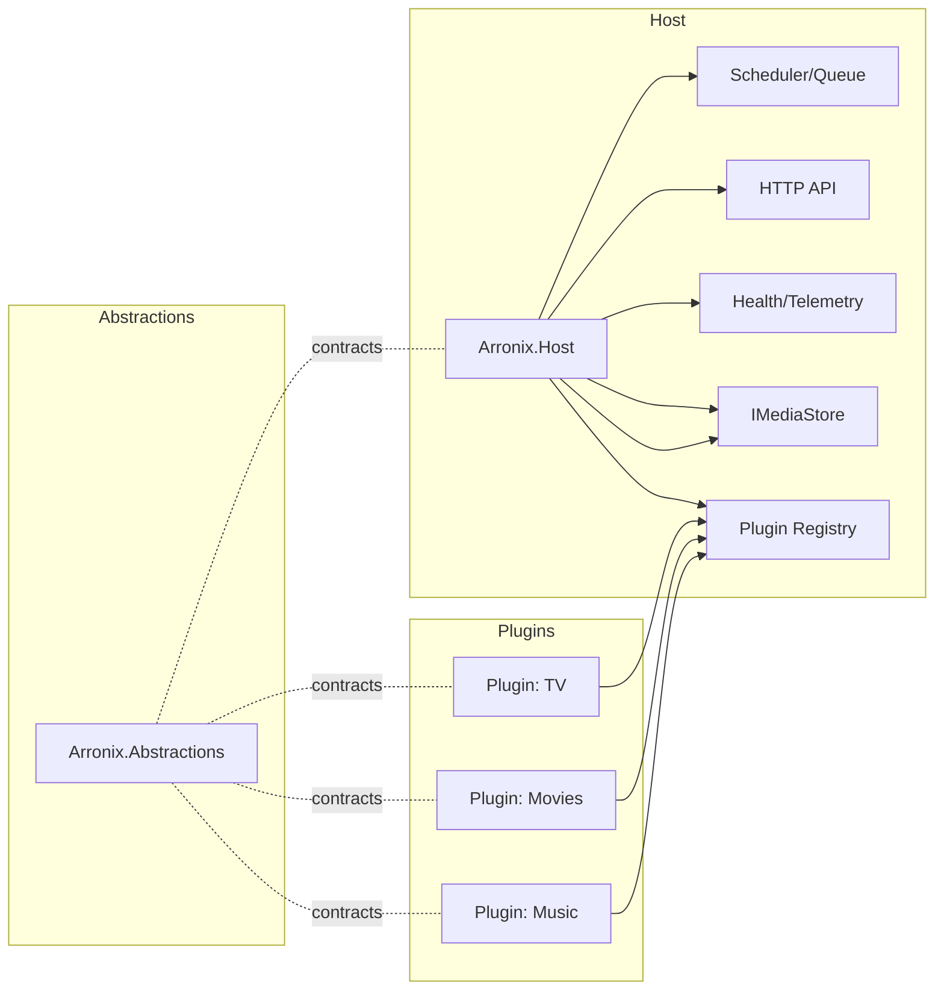

# Arronix

Arronix is a **modular, extensible media automation platform**. It enables different media types—TV, movies, music, books, and more—to operate as plugins on a shared, unified core.  

This project is an architectural restructuring of the Sonarr v5 codebase, evolving the *-arr* family into a single, coherent framework.

## Objectives

- Replace fragmented *-arr* applications with one shared architecture.  
- Separate **core orchestration** (queueing, scheduling, indexers, quality logic) from **media-specific logic**.  
- Provide a **plugin interface** that lets developers add new media kinds without modifying the core.  
- Maintain the usability and reliability of Sonarr while modernising its design.

## References

Links above cover the platform structure and shared terminology

- [Architecture](./ARCHITECTURE.md)
- [Glossary](./GLOSSARY.md)

## Why

- **Stop forking:** unify Sonarr/Radarr/Lidarr/etc. under one scheduler, queue, and API.  
- **Safe extensibility:** use contracts + manifests, not copy-paste.  
- **Operational simplicity:** one service, many libraries, consistent policies.

## Architecture Overview

```text
Core
 ├── Abstractions
 ├── Host Runtime
 ├── Plugin Loader
 └── Storage Layer
Plugins
 ├── TV
 ├── Movies
 ├── Music
 └── Books
```

Each plugin contributes metadata models, parsing rules, quality and import policies, and UI tokens that integrate seamlessly with the shared runtime.

## High-Level Architecture

- **Arronix.Abstractions:** stable contracts (interfaces/DTOs) for providers, policies, and jobs.  
- **Arronix.Host:** runtime — DI container, plugin loader (`AssemblyLoadContext`), schedulers, queue, HTTP API, health, telemetry.  
- **Plugins** (`/plugins/*`): each implements `IPluginModule` and ships a `plugin.json` manifest declaring capabilities, tokens, identifiers, and policy graphs.  
- **Storage:** polymorphic media model behind an `IMediaStore` façade; plugins own their specific tables, Core stores cross-media relations.  
- **Policies:** parsing, matching, quality, import, and naming are **policy chains** provided by plugins; Core executes them and enforces validation.



## Plugin Manifest

> **Note:** Purely for illustrative purposes only, specification hasnt been defined yet.

```json
{
  "id": "tv",
  "name": "TV Shows",
  "version": "0.1.0",
  "contracts": { "arronix": ">=0.1 <1.0" },
  "identifiers": ["tvdb","tmdb"],
  "capabilities": ["indexing","metadata","parsing","renaming","import"],
  "tokens": ["{SeriesTitle}","{SeasonNumber}","{EpisodeNumber}","{EpisodeTitle}"],
  "policies": {
    "parsing": ["SceneNumbering","MultiEpisode","YearDisambiguation"],
    "matching": ["ExactSeriesMatch","SeasonWindow","AirdateGuard"],
    "quality": ["SourceTier","Codec/BitDepth","Cutoff"],
    "import": ["LibraryLayout","Dup/UpgradeRules"]
  }
}
```

## Design Principles

- **Media-agnostic Core:** no TV/Movie types in Core.  
- **Stable Contracts:** versioned abstractions; plugins pin to ranges.  
- **Config-First:** manifests define tokens + policy graphs; code fills pragmatic gaps.  
- **Single Scheduler:** plugins register jobs; host coordinates.  
- **Testable by Design:** golden tests for parsing/renaming; contract tests for providers.

## Getting Started

Arronix is still in early development.  
To experiment locally:

```bash
git clone https://github.com/Arronix/ArronixCore.git
cd ArronixCore
dotnet build
dotnet run
```

More detailed setup and contribution guides will arrive as the architecture stabilises.

## Initial Work Plan

1. Core Abstractions & Contracts (#1)  
2. Plugin Loader & Manifests (#2)  
3. Extract TV into Plugin (#3)  
4. Storage Model & Migration (#4)  
5. Policy Pipelines (#5)

## Contributing

Arronix is an open-source community project.  
Contributions are welcome across all areas—architecture, plugins, UI, documentation, and testing.

> This repository currently tracks the refactor from Sonarr v5 (`sonarr-v5-develop` branch) toward the new modular core.  
> Please open issues for architectural discussions or early plugin proposals.

## License & Acknowledgements

- Licensed under the **GNU GPL v3**.  
- Portions of the code originated from **Sonarr v5**, © 2010–2025 the Sonarr developers, used under the GPLv3 license.  
- Arronix is an independent project unaffiliated with the original Sonarr or Servarr teams.
