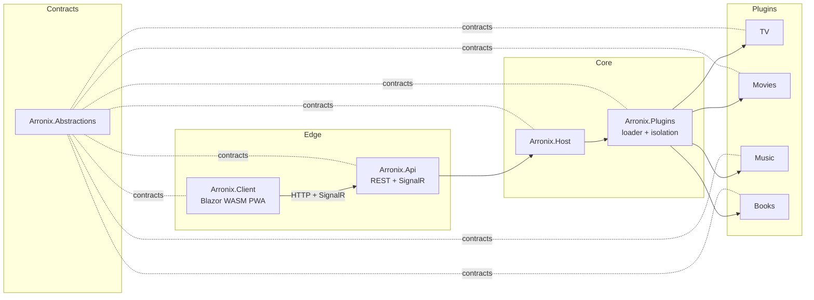

# Arronix

Arronix is a **modular, extensible media automation platform**. It enables different media types—TV, movies, music, books, and more—to operate as plugins on a shared, unified core.  

**Arronix is a clean-sheet rewrite, not a refactor of an existing application.** It is *informed by* the *-arr*
family — their behavior, their data models and their failure modes are surveyed in detail as evidence for design
decisions — but no code, schema, contract or wire shape is carried across. There is **no backwards compatibility
and no in-place upgrade path**: migration from a specific version of a specific *-arr* application is the job of
separate, later, version-specific scripts, which is where version-specific knowledge belongs. The legacy Sonarr
tree still present in this repository is frozen, referenced by no `Arronix.*` project, and is not being evolved
into Arronix.

> **Project status: early, pre-alpha, not runnable end to end.** The contract layer, the plugin loader, the host
> subsystems, four reference media plugins, the HTTP API and the web client build clean and are tested, but there
> is **no persistence** — nothing survives a restart — and no plugin reaches Active on a production host. See
> [Status](#status) below for the honest per-component picture.

## Objectives

- Replace fragmented *-arr* applications with one shared architecture.  
- Separate **core orchestration** (queueing, scheduling, indexers, quality logic) from **media-specific logic**.  
- Provide a **plugin interface** that lets developers add new media kinds without modifying the core.  
- Reach the usability and reliability *-arr* users expect, on a design chosen fresh rather than inherited.

## References

- [Architecture](./ARCHITECTURE.md) — layering, plugin model, the media shape model, API strategy
- [Glossary](./GLOSSARY.md) — shared terminology
- [Contributing](./CONTRIBUTING.md)
- [API stability policy](./docs/contracts/stability.md)
- [Design notes](./docs/design/) — intended end states; **not** evidence that something exists

## Why

- **Stop forking:** unify Sonarr/Radarr/Lidarr/etc. under one scheduler, queue, and API.  
- **Safe extensibility:** use contracts + manifests, not copy-paste.  
- **Operational simplicity:** one service, many libraries, consistent policies.

## Project Layout

```text
src/
  Arronix.Abstractions/       0.3.0  Contracts. Zero package references — the only assembly a
                                     plugin or the browser client may reference.
  Arronix.Common/             0.1.0  Host-side shared implementation of the contract layer.
  Arronix.Plugins/            0.1.0  Manifest, versioning, assembly isolation, the 16-step
                                     load pipeline, capability gating, scoped services.
  Arronix.Host/               0.1.0  Composition root: media kind registry, shape validation,
                                     media store, scheduler/queue, providers, health, intent.
  Arronix.Api/                0.1.0  ASP.NET Core REST + SignalR. NOT Blazor; zero packages.
  Arronix.Client/             0.1.0  Blazor WebAssembly PWA. References Abstractions only.

  Arronix.Plugin.Tv/          0.1.0  ┐ Reference media plugins. Each declares exactly one
  Arronix.Plugin.Movies/      0.1.0  │ project reference (Abstractions) and zero packages.
  Arronix.Plugin.Music/       0.1.0  │ Between them they exercise every optional construct
  Arronix.Plugin.Books/       0.1.0  ┘ in the media shape model.

  *.Tests/                           Abstractions, Common, Plugins, Host, Plugin.Tv,
                                     Plugin.Music, plus Arronix.Architecture.Tests
                                     (the platform invariants, enforced) — 1,313 tests.

  NzbDrone.* / Sonarr.* / frontend/  Legacy Sonarr tree. Untouched, and referenced by no
                                     Arronix project. Builds via src/Sonarr.sln.
```

## Status

| Component | Status |
|-----------|--------|
| `Arronix.Abstractions` | ✅ Implemented (0.3.0) — 5 new contract areas published `[Experimental]` |
| `Arronix.Common` | ✅ Implemented |
| `Arronix.Plugins` (loader) | ✅ Implemented — isolation, capability gating, 16-step admission |
| `Arronix.Host` | 🟡 Partial — every subsystem builds and is tested, but five platform services are unimplemented, so **no plugin currently reaches Active on a production host** |
| Media shape registry | ✅ Implemented — 16-rule validation gate; all four reference shapes pass |
| Scheduler / queue | 🟡 Partial — grammar, throttling, backoff and classification work; **state is in-memory** |
| Storage | 🟡 Partial — seam and invariants exist; **in-memory only, no persistence, no EF Core** |
| Providers | 🟡 Partial — registry, definitions, status and dispatch exist; no concrete provider ships |
| Health | ✅ Implemented (aggregator + three contributors) |
| Telemetry | 🚧 Contracts only — **no emitter, no sink, nothing is emitted** |
| `Arronix.Api` | 🟡 Partial — builds clean; **no authentication** and no persistence behind it |
| `Arronix.Client` | ✅ Implemented — builds and publishes clean to `browser-wasm` |
| Policy engine | 🚧 Planned — policy chains are declared and validated, but **nothing executes them** |
| Legacy compatibility API | ❌ **Refused, not deferred** — Arronix presents no *-arr*-shaped endpoints, shares no database with any *-arr* app, and offers no in-place upgrade path. Migration is import-based, by separate later scripts. |

Verification, reproduced from a clean checkout:

```
dotnet build Arronix.sln   →  0 warnings, 0 errors
dotnet test  Arronix.sln   →  1,313 passed, 1 skipped, 0 failed
```

Warnings are errors platform-wide, so "0 warnings" is a build gate rather than a courtesy.

## Architecture Overview


```mermaid
flowchart LR
  subgraph Contracts
    A[Arronix.Abstractions]
  end

  subgraph Core
    Loader[Arronix.Plugins<br/>loader + isolation]
    Host[Arronix.Host]
  end

  subgraph Edge
    Api[Arronix.Api<br/>REST + SignalR]
    Client[Arronix.Client<br/>Blazor WASM PWA]
  end

  subgraph Plugins
    TV[TV] 
    MV[Movies]
    MU[Music]
    BK[Books]
  end

  A -. contracts .- Host
  A -. contracts .- Loader
  A -. contracts .- Api
  A -. contracts .- Client
  A -. contracts .- TV
  A -. contracts .- MV
  A -. contracts .- MU
  A -. contracts .- BK

  Host --> Loader
  Loader --> TV & MV & MU & BK
  Api --> Host
  Client -- HTTP + SignalR --> Api
```

The one-way arrows are the design. `Arronix.Client` and every `Arronix.Plugin.*` declare **exactly one** project
reference — `Arronix.Abstractions` — so neither a plugin nor the browser can reach a host-side implementation
assembly. That is checkable in the project files rather than being a convention.

- **Arronix.Abstractions:** contracts for identity, media shape, providers, intent, wire DTOs, policies and jobs.
- **Arronix.Plugins:** discovers `plugin.json`, isolates each plugin in its own assembly load context, verifies its
  reference graph from PE metadata *before* loading it, and gates every registration against declared capabilities.
- **Arronix.Host:** validates each plugin's declared media shape, registers its kinds, and owns the scheduler,
  queue, media store, provider subsystem, health aggregation and intent registry.
- **Arronix.Api:** a plain ASP.NET Core REST + SignalR server. It contains no Razor file and takes no package
  references, and it serves the client as static files rather than referencing it.
- **Arronix.Client:** an installable Blazor WebAssembly PWA that renders any media kind from the descriptors the
  host publishes. It holds no compile-time knowledge of any media kind — a fifth kind needs zero client changes.

### The media shape model

The central concept. A media kind is not a class hierarchy the host has to know about; it is a **value** a plugin
declares — levels and their roles, how files bind to items, how items are addressed, how they group, how quality
ladders and selection facets work, how the kind can be searched. The host validates that declaration against
sixteen structural rules, derives what a user can do with it, and publishes it. See
[ARCHITECTURE §5](./ARCHITECTURE.md#5-the-media-shape-model).

## Plugin Manifest

A real, loading manifest (abridged from `src/Arronix.Plugin.Tv/plugin.json`):

```json
{
  "schemaVersion": 0,
  "id": "tv",
  "name": "Television",
  "version": "0.1.0",
  "contracts": { "arronix": ">=0.3 <0.4" },
  "entryAssembly": "Arronix.Plugin.Tv.dll",
  "mediaKinds": ["tv"],
  "identifiers": ["tvdb", "tmdb", "imdb"],
  "capabilities": ["media-kind", "parsing", "matching", "indexing", "quality", "renaming", "metadata"],
  "tokens": [
    { "name": "{Series Title}", "description": "The library entry's title", "exampleValue": "The Expanse", "isRequired": true }
  ],
  "policies": {
    "parsing": ["OrdinalPair", "CalendarDate", "FlatOrdinal", "MultiUnit", "WholeRun", "YearDisambiguation"]
  }
}
```

The contract range is bounded at the host's next minor deliberately: plugins consuming experimental contracts are
refused if they claim compatibility further ahead than that. Full field rules and the 16-step load pipeline are in
[ARCHITECTURE §4.1](./ARCHITECTURE.md#41-manifest-specification-schemaversion-0).

## Design Principles

- **Media-agnostic Core:** no TV/Movie types in Core — enforced by the reference graph, not by convention.
- **Versioned Contracts:** plugins pin to ranges; experimental contracts are gated and greppable. Stability is a
  guarantee that begins **at 1.0** — below it, any contract may be changed, renamed or deleted in a minor release,
  and a contract with no implementer outside this repository is deleted rather than deprecated.
- **Declaration over code:** a media kind is a value, not a class hierarchy.
- **Derive rather than declare:** anything the host can compute is not something a plugin gets to assert.
- **Single Scheduler:** plugins register jobs; host coordinates.
- **Parse, don't validate:** after the shape gate, no host lookup can fail.
- **Testable by Design:** contract tests, shape corpus tests, and a loader test that emits a real plugin assembly.

## Getting Started

Arronix is in early development. Requires the **.NET 10 SDK** (see `global.json`; prerelease is allowed).

```bash
git clone https://github.com/Arronix/ArronixCore.git
cd ArronixCore

# Build the platform: 0 warnings, 0 errors. Warnings are errors, so this is a gate.
dotnet build Arronix.sln

# Run the suite: 1,313 passed, 1 skipped.
dotnet test Arronix.sln
```

There is **no runnable application yet**. `Arronix.Api` is the eventual entry point; no plugin activates until the
host registers the five platform services listed in
[ARCHITECTURE §3](./ARCHITECTURE.md#3-core-components), nothing is persisted, and there is no authentication.

The legacy Sonarr application is unaffected and still builds from `src/Sonarr.sln` with the existing
yarn/webpack frontend workflow.

## License & Acknowledgements

- Licensed under the **GNU GPL v3**.  
- This repository still contains the **Sonarr v5** tree (`src/NzbDrone.*`, `src/Sonarr.*`, `frontend/`), © 2010–2025
  the Sonarr developers, used under the GPLv3 license. It is frozen and is referenced by no `Arronix.*` project;
  the `Arronix.*` sources are written fresh rather than derived from it.  
- Arronix is an independent project unaffiliated with the original Sonarr or Servarr teams.
